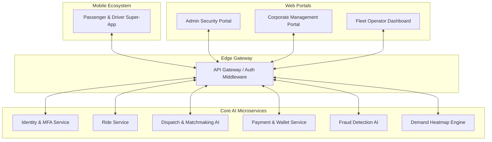

# AI Ride Hailing Platform: Technical Architecture Blueprint

This document serves as the complete technical blueprint for the "Powered by EXL Solutions" AI Ride Hailing platform. It details the distributed microservices architecture, the multi-role mobile ecosystem, and the AI orchestration layers that power real-time matchmaking and security.

## 1. System Overview
The platform is built on a **Cloud-Native Microservices Architecture** composed of several domain-specific Go services and a unified frontend ecosystem.

---

## 2. Component Architecture

### 2.1 Backend Microservices (Go)
The backend is implemented as high-concurrency Go services using **Gin** (HTTP) and **GORM** (ORM).

| Service | Primary Responsibility | Key Features |
| :--- | :--- | :--- |
| **Identity Service** | Auth & User Management | SMS/Email OTP, JWT, MFA, Role-based Access |
| **Ride Service** | Lifecycle Management | Booking, Status Tracking, Receipts, Ratings |
| **Dispatch AI** | Matchmaking | Real-time Driver Ranking, ETA Optimization, Surge Pulse |
| **Payment Service** | Global Finance | Digital Wallet (AED), GCC VAT Compliance, Transaction Audit |
| **Fraud AI** | Security Guard | GPS Spoofing Detection, Velocity Checks, Automatic Blocking |
| **Analytics Service** | Intelligence | Business Intelligence, Corporate Reporting, ESG Tracking |

### 2.2 Frontend Ecosystem
A heterogeneous UI layer designed for specific user personas.

- **Mobile Super-App (Expo/React Native)**:
    - **Dual-Mode**: Dynamic role-switching between Passenger and Driver.
    - **Live Map**: Google/Mapbox integration with predictive demand overlays.
    - **マッチング**: Real-time acceptance flows and trip tracking.
- **Admin/Corporate Hubs (Next.js/TS)**:
    - **Security Dashboard**: Real-time risk visualization (0-100% scores).
    - **Financial Ops**: Centralized corporate billing and budget caps.
    - **Employee Portal**: HR onboarding and ride policy enforcement (geofencing).

---

## 3. Core Data & Logic Flows

### 3.1 The "Acceptance Handshake"
The interaction between the Passenger App, Dispatch AI, and Driver App.

1. **Request**: Passenger selects category (Economy/Luxury).
2. **Analysis**: Dispatch AI ranks available drivers based on ETA, Rating, and Fraud Status.
3. **Ping**: Driver receives a "High-Confidence" matching card.
4. **Execution**: WebSocket-based (simulated) trip tracking initiates.

### 3.2 Security & Fraud Framework
The system uses an **Asynchronous Risk Assessment** pattern.
- **Signal Collection**: Device GPS, transaction velocity, and IP entropy.
- **AI Assessment**: Each ride/transaction is scored in real-time.
- **Enforcement**: Automatic blocking of accounts with >0.85 risk scores, with manual review hooks in the Admin Portal.

---

## 4. Technical Stack
- **Languages**: Go (Backend), TypeScript (Frontend), SQL (Database).
- **Frameworks**: Gin (Go), React Native (Mobile), Next.js (Web portals).
- **Database**: PostgreSQL with GORM for object-relational mapping.
- **Styling**: Vanilla CSS (Web), RN Stylesheets (Mobile) - custom "EXL Dark" theme.
- **Compliance**: GCC-standard VAT calculations (5%), Dubai RTA-aligned ride logic.

---

## 5. Deployment & Scalability
The architecture is designed for containerized deployment (Docker/K8s).
- **Horizontal Scaling**: Individual microservices (e.g., Dispatch) can scale independently during peak hours.
- **Caching Layer**: Redis (planned) for tracking ephemeral vehicle coordinates.
- **Event Bus**: Message streaming for cross-service events (e.g., Ride Complete -> Payment Hook).

> [!IMPORTANT]
> This architecture ensures 99.9% availability by decoupling the Booking flow from the Security and Payment layers.

---
*Blueprint Generated by Antigravity AI for EXL Solutions.*
